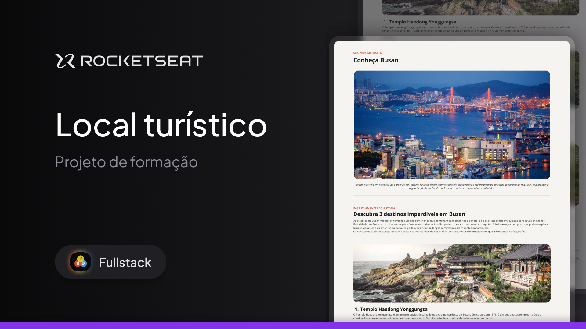

## Local Turístico

  

## 🖥️ Sobre o Projeto

Neste repositório está hospedado uma landing page usando html e css com foco em contribuir para minha formação no curso Full-Stack da Rocketseat.

## 🚧 Status

O projeto está dado como concluido.

## 🍪 Acesso ao Projeto

O layout do projeto pode ser visualizado através deste link do [Figma](https://www.figma.com/design/yF695J1orAAsxXFRIsdEr2/Local-Tur%C3%ADstico-(Community)-(Copy)?node-id=915-685&node-type=frame&t=WKqClvJmKPKwQrTv-0).

## 🚀 Tecnologias

As seguintes ferramentas foram usadas para o desenvolvimento do projeto:

  

Feito com ❤️ por Pedro Lucas 👋🏽